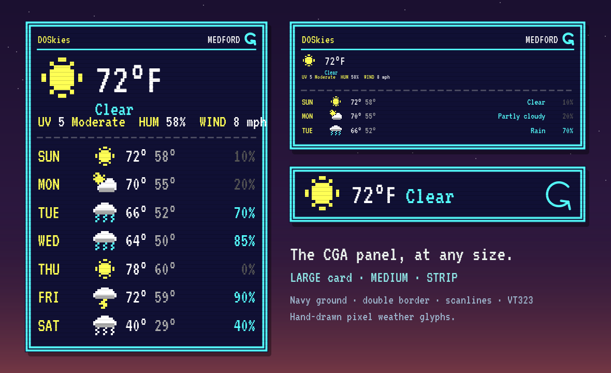
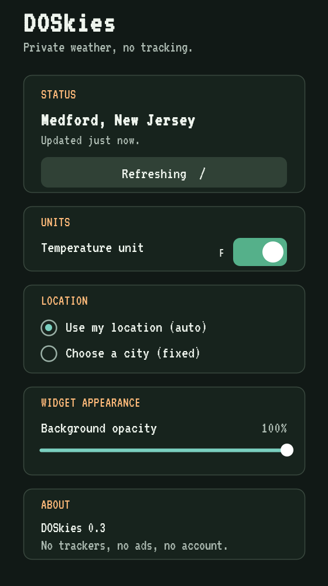

# DOSkies

A weather widget for Android that minds its own business.

Seven days on your home screen — high and low temperature and the chance of rain — drawn in a
DOS/pixel style so it belongs next to pixel wallpaper and DOS-style app icons. No ads, no trackers,
no cookies, no account, no API key, no subscription. It talks to exactly one weather service
([Open-Meteo](https://open-meteo.com)) and, only if you turn it on, your own update host. That is
the entire list of things it phones home to.

Built for GrapheneOS on a Pixel 7, but it is ordinary Android underneath: **minSdk 31**, no Google
Play services, no Fused Location, no runtime dependencies at all.

## Screenshots

| The widget, at three sizes | Settings |
|---|---|
|  |  |

*Rendered previews, drawn from the real look spec (palette, VT323 font, and the hand-authored glyph
grids). On-device captures from the Pixel 7 will replace these.*

## Features

- **Seven-day forecast** — each day shows a hand-drawn pixel weather glyph, the high/low, and the
  chance of rain.
- **Live current conditions** — temperature, condition, plus UV index (with a Low→Extreme band),
  humidity, and wind.
- **One adaptive widget, many shapes** — it picks its own layout from the size you give it: a wide
  row (current conditions on the left, all seven days across) when it is short and wide, or a
  stacked strip / medium / large card when it is taller. Resize it and it recomposes.
- **The DOS/CGA look** — a DOS window (title bar + double border), an authentic CGA-16 palette on a
  navy ground, the [VT323](https://fonts.google.com/specimen/VT323) pixel font, optional scanlines,
  and ten hand-authored 12×12 weather glyphs. All rendered to a bitmap so it stays crisp at any size.
- **Adjustable panel opacity** — turn it down to let your wallpaper show through the panel.
- **Fahrenheit or Celsius** — one toggle; wind units follow (mph / km/h).
- **Location, your call** — auto (coarse location, asked at runtime) or a fixed city you search for
  by name. Deny location and it simply uses your saved place.
- **Demo mode** — preview the widget with a clearly-marked sample forecast, no network call. It is
  an explicit choice you turn on; it is *never* used to paper over a failed refresh.
- **Honest failures** — if a fetch fails, your last good forecast stays on screen with the error
  noted, instead of being blanked or replaced with zeros. It never invents a forecast.

## Updates (self-hosted, no store)

DOSkies is distributed as a signed APK, not through the Play Store, and it keeps itself current
through a small **self-hosted updater** you control:

- The app checks a single update host — by default the author's own Cloudflare Worker, and you can
  point it at any URL in the app's **Updates** card. There is no account, device ID, or telemetry in
  that request.
- A daily background check looks only at `latest.json`. If a genuinely newer version exists, it
  posts **one** notification. **Nothing downloads or installs on its own.**
- Tapping **Update** downloads the APK, verifies its size and checksum, and hands off to the
  platform installer. GrapheneOS (and stock Android) will ask you to allow installs from DOSkies the
  first time; the app sends you straight to that setting.

The update host lives in [`updates/`](updates/) and is deployed by the maintainer.

## Building

```
powershell -NoProfile -ExecutionPolicy Bypass -File scripts/build.ps1
```

`build.ps1` is the gate: it assembles a release APK, runs the full offline unit and widget-render
test suite, and lints — all must pass. The JDK and Android SDK live in a local, git-ignored
`.tools/` directory, so nothing is installed system-wide and the build needs no network.

Other scripts in [`scripts/`](scripts/): `ensure-signing.ps1` (signing key), `ship.ps1` (build +
gate + sign), `verify-apk.ps1` (inspect a built APK), and `publish.ps1` (push a release to the
update host).

## Installing

Download the signed APK from the host (or build your own), open it on the phone, and allow the
install when prompted. Then long-press the home screen → **Widgets** → **DOSkies**, drop it, and
resize it to taste. After that, updates arrive through the in-app updater described above.

## Privacy

DOSkies stores no secrets and holds no account, so there is nothing here to encrypt. Your location
and settings stay on the device in plain app storage. Location is coarse only (never fine), optional,
and requested at runtime. The **only** network calls the app makes are to Open-Meteo for the forecast
and, if you enable it, to your chosen update host — nothing else.

## Project docs

- [PLAN.md](PLAN.md) — the build order, decisions, and handoff status.
- [AGENTS.md](AGENTS.md) — house rules for anyone (human or agent) working on it.
- [docs/T5-LOOK-SPEC.md](docs/T5-LOOK-SPEC.md) — the CGA panel look and the ten glyph grids.
- [CREDITS.md](CREDITS.md) — data and asset licenses.

## Credits

Weather data by [Open-Meteo](https://open-meteo.com) (CC BY 4.0). The VT323 font and the pixel glyph
assets and their licenses are listed in [CREDITS.md](CREDITS.md).

## License

[MIT](LICENSE).
